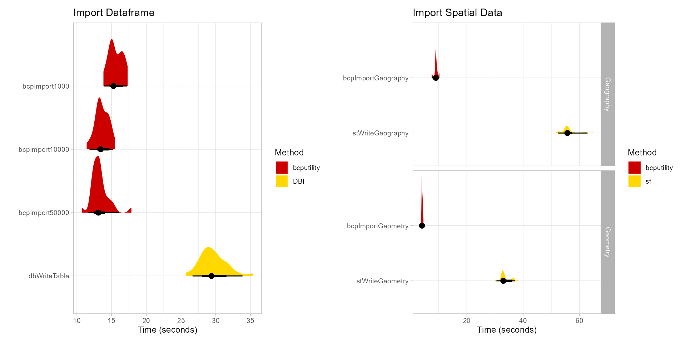

# bcputility <a href='https://bcputility.delveds.com'></a>

<!-- badges: start -->
[](https://CRAN.R-project.org/package=bcputility)
[](https://github.com/tomroh/bcputility/actions)
[](https://lifecycle.r-lib.org/articles/stages.html#stable)
[](https://cran.r-project.org/package=bcputility)
<!-- badges: end -->


**bcputility** is a wrapper for the command line utility program from SQL Server 
that does bulk imports/exports. The package assumes that [bcp](https://learn.microsoft.com/en-us/sql/tools/bcp-utility)
is already installed and is on the system search path. For large inserts to SQL 
Server over an ODBC connection (e.g. with the 
"[DBI](https://dbi.r-dbi.org/)" package), writes can take a very long time as 
each row generates an individual insert statement. The bcp Utility greatly 
improves performance of large writes by using bulk inserts.

An export function is provided for convenience, but likely will not significantly
improve performance over other methods.

## Prerequisites

The system dependencies can be downloaded and installed from 
[Microsoft](https://learn.microsoft.com/en-us/sql/tools/bcp-utility#download-the-latest-version-of-the-bcp-utility). 
It is recommended to add `bcp` and `sqlcmd` to the system path. 

## Installation

You can install the released version of bcputility from 
[CRAN](https://CRAN.R-project.org) with:

```r
install.packages("bcputility")
```

Install the development version with:

```r
devtools::install_github("tomroh/bcputility")
```

To check if the prerequisite binaries are on the path: 

```r
bcpVersion()
sqlcmdVersion()
```

If `bcp` and `sqlcmd` is not on the system path or you want to override the default, set the option with the full file path:

```r
options(bcputility.bcp.path = "<path-to-bcp>")
options(bcputility.sqlcmd.path = "<path-to-sqlcmd>")
```

## Usage

Trusted Connection (default):

```r
x <- read.csv("<file.csv>")
connectArgs <- makeConnectArgs(server = "<server>", database = "<database>")
bcpImport(x = x, connectargs = connectArgs, table = "<table>")
```

SQL Authentication:

```r
connectArgs <- makeConnectArgs(server = "<server>", database = "<database>",
  username = "<username>", password = "<password>")
bcpImport(x = x, connectargs = connectArgs, table = table)
```

## Benchmarks

Benchmarks were performed with a local installation of SQL Server Express. 
When testing with a remote SQL Server, performance of *bcp* over *odbc* was further 
improved.



### Import

```r
library(DBI)
library(data.table)
library(bcputility)
server <- Sys.getenv('MSSQL_SERVER')
database <- Sys.getenv('MSSQL_DB')
driver <- 'ODBC Driver 17 for SQL Server'
set.seed(11)
n <- 1000000
importTable <- data.frame(
  int = sample(x = seq(1L, 10000L, 1L), size = n, replace = TRUE),
  numeric = sample(x = seq(0, 1, length.out = n/100), size = n,
    replace = TRUE),
  character = sample(x = state.abb, size = n, replace = TRUE),
  factor = sample(x = factor(x = month.abb, levels = month.abb),
    size = n, replace = TRUE),
  logical = sample(x = c(TRUE, FALSE), size = n, replace = TRUE),
  date = sample(x = seq(as.Date('2022-01-01'), as.Date('2022-12-31'),
    by = 'days'), size = n, replace = TRUE),
  datetime = sample(x = seq(as.POSIXct('2022-01-01 00:00:00'),
    as.POSIXct('2022-12-31 23:59:59'), by = 'min'), size = n, replace = TRUE)
)
connectArgs <- makeConnectArgs(server = server, database = database)
con <- DBI::dbConnect(odbc::odbc(),
                      Driver = "SQL Server",
                      Server = server,
                      Database = database)
importResults <- microbenchmark::microbenchmark(
  bcpImport1000 = {
    bcpImport(importTable,
              connectargs = connectArgs,
              table = 'importTable1',
              bcpOptions = list("-b", 1000, "-a", 4096, "-e", 10),
              overwrite = TRUE,
              stdout = FALSE)
    },
  bcpImport10000 = {
    bcpImport(importTable,
              connectargs = connectArgs,
              table = 'importTable2',
              bcpOptions = list("-b", 10000, "-a", 4096, "-e", 10),
              overwrite = TRUE,
              stdout = FALSE)
  },
  bcpImport50000 = {
    bcpImport(importTable,
              connectargs = connectArgs,
              table = 'importTable3',
              bcpOptions = list("-b", 50000, "-a", 4096, "-e", 10),
              overwrite = TRUE,
              stdout = FALSE)
  },
  bcpImport100000 = {
    bcpImport(importTable,
      connectargs = connectArgs,
      table = 'importTable4',
      bcpOptions = list("-b", 100000, "-a", 4096, "-e", 10),
      overwrite = TRUE,
      stdout = FALSE)
  },
  dbWriteTable = {
    con <- DBI::dbConnect(odbc::odbc(),
      Driver = driver,
      Server = server,
      Database = database,
      trusted_connection = 'yes')
    DBI::dbWriteTable(con, name = 'importTable5', importTable, overwrite = TRUE)
    },
  times = 30L,
  unit = 'seconds'
)
importResults
```

|expr            |       min|        lq|      mean|    median|        uq|      max| neval|
|:---------------|---------:|---------:|---------:|---------:|---------:|--------:|-----:|
|bcpImport1000   | 15.017385| 16.610868| 17.405555| 17.656265| 18.100990| 19.44482|    30|
|bcpImport10000  | 10.091266| 10.657926| 10.926738| 10.916577| 11.208184| 11.46027|    30|
|bcpImport50000  |  8.982498|  9.337509|  9.677375|  9.571526|  9.896179| 10.77709|    30|
|bcpImport100000 |  8.769598|  9.303473|  9.562921|  9.581927|  9.855355| 10.36949|    30|
|dbWriteTable    | 13.570956| 13.820707| 15.154505| 14.159002| 16.378986| 27.28819|    30|

*Time in seconds*

### Export Table

**Note:** *bcp* exports of data may not match the format of ```fwrite```. 
```dateTimeAs = 'write.csv'``` was used to make timings comparable, which 
decreased the performance of "[data.table](https://rdatatable.gitlab.io/data.table/)". 
Optimized write formats for date times from ```fwrite``` outperforms *bcp* for 
data that is small enough to be pulled into memory.

```r
exportResults <- microbenchmark::microbenchmark(
  bcpExportChar = {
    bcpExport('inst/benchmarks/test1.csv',
              connectargs = connectArgs,
              table = 'importTableInit',
              fieldterminator = ',',
              stdout = FALSE)
    },
  bcpExportNchar = {
    bcpExport('inst/benchmarks/test2.csv',
              connectargs = connectArgs,
              table = 'importTableInit',
              fieldterminator = ',',
              stdout = FALSE)
  },
  fwriteQuery = {
    fwrite(DBI::dbReadTable(con, 'importTableInit'),
           'inst/benchmarks/test3.csv', dateTimeAs = 'write.csv',
           col.names = FALSE)
  },
  times = 30L,
  unit = 'seconds'
)
exportResults
```

|expr           |      min|       lq|     mean|   median|       uq|      max| neval|
|:--------------|--------:|--------:|--------:|--------:|--------:|--------:|-----:|
|bcpExportChar  | 2.565654| 2.727477| 2.795670| 2.756685| 2.792291| 3.352325|    30|
|bcpExportNchar | 2.589367| 2.704135| 2.765784| 2.734957| 2.797286| 3.479074|    30|
|fwriteQuery    | 7.429731| 7.602853| 7.645852| 7.654730| 7.703634| 7.868419|    30|

*Time in seconds*

### Export Query

```r
query <- 'SELECT * FROM [dbo].[importTable1] WHERE int < 1000'
queryResults <- microbenchmark::microbenchmark(
  bcpExportQueryChar = {
    bcpExport('inst/benchmarks/test4.csv',
              connectargs = connectArgs,
              query = query,
              fieldterminator = ',',
              stdout = FALSE)
  },
  bcpExportQueryNchar = {
    bcpExport('inst/benchmarks/test5.csv',
              connectargs = connectArgs,
              query = query,
              fieldterminator = ',',
              stdout = FALSE)
  },
  fwriteQuery = {
    fwrite(DBI::dbGetQuery(con, query),
           'inst/benchmarks/test6.csv', dateTimeAs = 'write.csv',
           col.names = FALSE)
  },
  times = 30L,
  unit = 'seconds'
)
queryResults
```

|expr                |       min|        lq|      mean|    median|        uq|       max| neval|
|:-------------------|---------:|---------:|---------:|---------:|---------:|---------:|-----:|
|bcpExportQueryChar  | 0.3444491| 0.4397317| 0.4557119| 0.4490924| 0.4615573| 0.7237182|    30|
|bcpExportQueryNchar | 0.3305265| 0.4444705| 0.4412670| 0.4500690| 0.4605971| 0.4815894|    30|
|fwriteQuery         | 0.6737879| 0.7141933| 0.7421377| 0.7311998| 0.7548233| 0.9143555|    30|

*Time in seconds*

### Import Geometry

Importing spatial data from 'sf' objects is also supported. The sql statements 
after import are to produce equivalent tables in the database.

```r
library(sf)
nc <- st_read(system.file("gpkg/nc.gpkg", package = "sf"))
divN <- 10
shp1 <- cbind(nc[sample.int(nrow(nc), n / divN, replace = TRUE),],
  importTable[seq_len(n / divN), ],
  id = seq_len(n / divN))
geometryResults <- microbenchmark::microbenchmark(
  bcpImportGeometry = {
    bcpImport(shp1,
      connectargs = connectArgs,
      table = 'shp1',
      overwrite = TRUE,
      stdout = FALSE,
      spatialtype = 'geometry',
      bcpOptions = list("-b", 50000, "-a", 4096, "-m", 0))
  },
  odbcImportGeometry = {
    con <- DBI::dbConnect(odbc::odbc(),
      driver = driver,
      server = server,
      database = database,
      trusted_connection = 'yes')
    tableName <- 'shp2'
    spatialType <- 'geometry'
    geometryColumn <- 'geom'
    binaryColumn <- 'geomWkb'
    srid <- sf::st_crs(nc)$epsg
    shpBin2 <- data.table(shp1)
    data.table::set(x = shpBin2, j = binaryColumn,
      value = blob::new_blob(lapply(sf::st_as_binary(shpBin2[[geometryColumn]]),
        as.raw)))
    data.table::set(x = shpBin2, j = geometryColumn, value = NULL)
    dataTypes <- DBI::dbDataType(con, shpBin2)
    dataTypes[binaryColumn] <- 'varbinary(max)'
    DBI::dbWriteTable(conn = con, name = tableName, value = shpBin2,
      overwrite = TRUE, field.types = dataTypes)
    DBI::dbExecute(conn = con, sprintf('alter table %1$s add %2$s %3$s;',
      tableName, geometryColumn, spatialType))
    DBI::dbExecute(conn = con,
      sprintf('UPDATE %1$s
    SET geom = %3$s::STGeomFromWKB([%4$s], %2$d);
    ALTER TABLE %1$s DROP COLUMN [%4$s];', tableName, srid, spatialType,
        binaryColumn)
    )
  },
  bcpImportGeography = {
    bcpImport(shp1,
      connectargs = connectArgs,
      table = 'shp3',
      overwrite = TRUE,
      stdout = FALSE,
      spatialtype = 'geography',
      bcpOptions = list("-b", 50000, "-a", 4096, "-m", 0))
  },
  odbcImportGeography = {
    con <- DBI::dbConnect(odbc::odbc(),
      driver = driver,
      server = server,
      database = database,
      trusted_connection = 'yes')
    tableName <- 'shp4'
    spatialType <- 'geography'
    geometryColumn <- 'geom'
    binaryColumn <- 'geomWkb'
    srid <- sf::st_crs(nc)$epsg
    shpBin4 <- data.table(shp1)
    data.table::set(x = shpBin4, j = binaryColumn,
      value = blob::new_blob(lapply(sf::st_as_binary(shpBin4[[geometryColumn]]),
        as.raw)))
    data.table::set(x = shpBin4, j = geometryColumn, value = NULL)
    dataTypes <- DBI::dbDataType(con, shpBin4)
    dataTypes[binaryColumn] <- 'varbinary(max)'
    DBI::dbWriteTable(conn = con, name = tableName, value = shpBin4,
      overwrite = TRUE, field.types = dataTypes)
    DBI::dbExecute(conn = con, sprintf('alter table %1$s add %2$s %3$s;',
      tableName, geometryColumn, spatialType))
    DBI::dbExecute(conn = con,
      sprintf('UPDATE %1$s
    SET geom = %3$s::STGeomFromWKB([%4$s], %2$d);
    ALTER TABLE %1$s DROP COLUMN [%4$s];', tableName, srid, spatialType,
        binaryColumn)
    )
    DBI::dbExecute(conn = con,
      sprintf(
        'UPDATE %1$s SET [%2$s] = [%2$s].MakeValid().ReorientObject().MakeValid()
   WHERE [%2$s].MakeValid().EnvelopeAngle() > 90;',
        tableName, geometryColumn))
  },
  times = 30L,
  unit = 'seconds'
)
geometryResults
```

|expr                |      min|       lq|     mean|   median|       uq|       max| neval|
|:-------------------|--------:|--------:|--------:|--------:|--------:|---------:|-----:|
|bcpImportGeometry   | 18.01451| 19.48747| 20.68834| 20.45136| 21.74212|  26.87033|    30|
|odbcImportGeometry  | 18.29721| 20.63363| 22.35044| 21.29087| 24.04490|  27.81112|    30|
|bcpImportGeography  | 71.23260| 75.04588| 82.65286| 76.36985| 96.68469| 102.70909|    30|
|odbcImportGeography | 73.29818| 76.12481| 84.58432| 77.93419| 97.36155| 107.00186|    30|

*Time in seconds*
